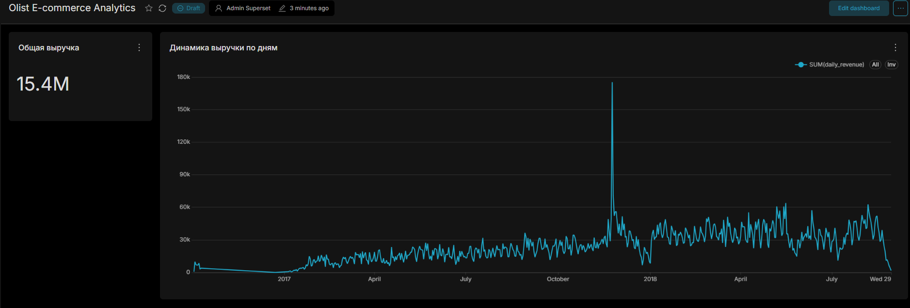

## О проекте
Полноценный Data Engineering пайплайн для обработки и аналитики данных бразильского маркетплейса **Olist** (более 100 000 заказов). 

Проект реализует классическую архитектуру **DWH**: автоматизированный сбор сырых данных, очистку и дедупликацию в промежуточном слое (Staging), а также построение аналитических витрин с использованием сложных оконных функций SQL для визуализации в BI-системе.

---

## Технологический стек
* **Оркестрация данных:** Apache Airflow
* **Хранилище данных (DWH):** PostgreSQL 16
* **Трансформации & ETL:** Python 3.10 (`pandas`, `psycopg2`), SQL (CTEs, Window Functions)
* **BI & Визуализация:** Apache Superset
* **Контейнеризация:** Docker & Docker Compose
* **ОС / Окружение:** Linux

---

## Структура репозитория

    olist-data-engineering/
    ├── dags/
    │   └── olist_pipeline.py       # DAG Airflow: оркестрация ETL и SQL-моделирования
    ├── sql/
    │   ├── 01_init_schema.sql      # DDL: создание слоев raw, staging, marts
    │   ├── 02_staging.sql          # DML: очистка, приведение типов и дедупликация
    │   └── 03_marts.sql            # DML: расчет бизнес-витрин (Revenue & Retention)
    ├── scripts/
    │   └── load_raw.py             # Python-скрипт батч-загрузки CSV в PostgreSQL
    ├── docker/
    │   └── docker-compose.yml      # Инфраструктура (Postgres, Airflow, Superset)
    ├── assets/                     # Скриншоты дашбордов и схемы архитектуры
    ├── .gitignore                  # Исключение тяжелых датасетов и виртуальных окружений
    └── README.md                   # Документация проекта

---

## Архитектура пайплайна (ETL / ELT)

Пайплайн оркестрируется через **Apache Airflow** и состоит из 4 последовательных этапов:

1. **`init_dwh_schema`**: Инициализация изолированных схем базы данных (`raw`, `staging`, `marts`).
2. **`extract_and_load_raw`**: Python-скрипт считывает сырые датасеты Olist из CSV и пакетно загружает их в слой `raw` (с использованием `psycopg2.extras.execute_values` для оптимальной производительности).
3. **`run_staging_transformations`**: Очистка данных на стороне БД: фильтрация отмененных заказов, парсинг временных меток из строк в `TIMESTAMP` и удаление дубликатов.
4. **`build_analytical_marts`**: Построение бизнес-витрин:
   * **`marts.daily_revenue`**: Агрегация ежедневной выручки доставленных заказов.
   * **`marts.customer_retention`**: Когортный анализ (Retention Rate) и расчет интервалов между покупками каждого клиента с использованием оконных функций:

         ROW_NUMBER() OVER (PARTITION BY c.customer_unique_id ORDER BY o.order_purchase_timestamp)
         LAG(purchase_date) OVER (PARTITION BY customer_unique_id ORDER BY purchase_date)

---

## BI Dashboard (Apache Superset)

В интерактивном дашборде реализованы ключевые метрики продуктовой аналитики:
* Динамика ежедневной выручки маркетплейса (Line Chart).
* Распределение повторных заказов и отток пользователей (Cohort Analysis).

*(Скриншот дашборда расположен в `assets/superset_dashboard.png`)*

---
## Быстрый запуск (Quickstart)

1. **Клонируйте репозиторий:**

       git clone https://github.com/ВАШ_ГИТХАБ_НИК/olist-data-engineering.git
       cd olist-data-engineering

2. **Подготовьте данные:**
   Скачайте [Olist E-Commerce Dataset с Kaggle](https://www.kaggle.com/datasets/olistbr/brazilian-ecommerce) и поместите файлы `olist_customers_dataset.csv`, `olist_orders_dataset.csv` и `olist_order_payments_dataset.csv` в директорию `data/`.

3. **Запустите контейнеры:**

       cd docker
       docker compose up -d

4. **Интерфейсы сервисов:**
   * **Apache Airflow:** `http://localhost:8080` (логин: `admin`, пароль: `admin`)
   * **Apache Superset:** `http://localhost:8088` (логин: `admin`, пароль: `admin`)
   * **PostgreSQL:** `localhost:5432`